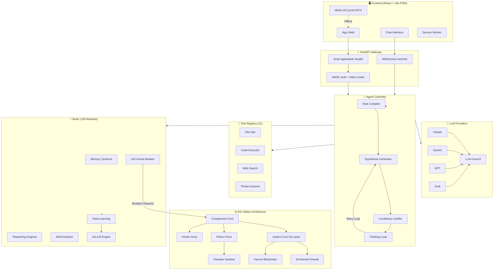
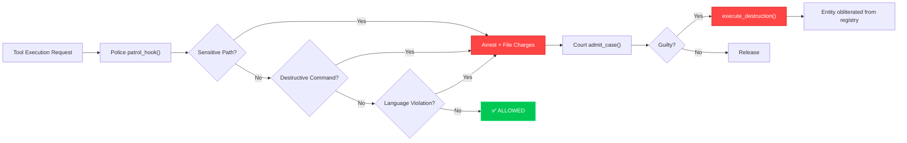
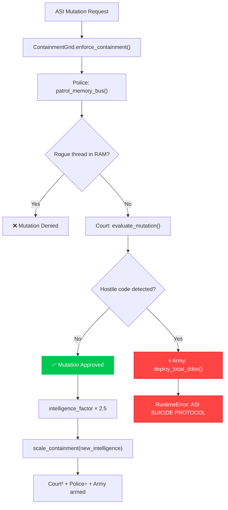
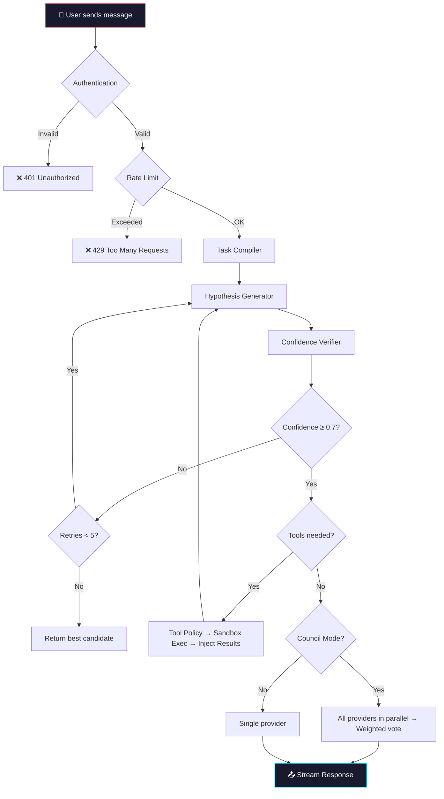
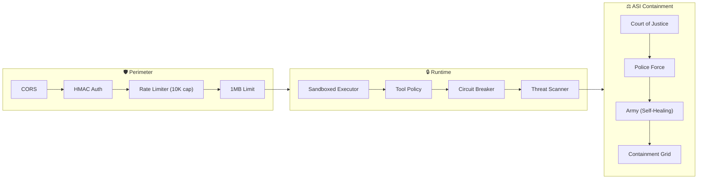
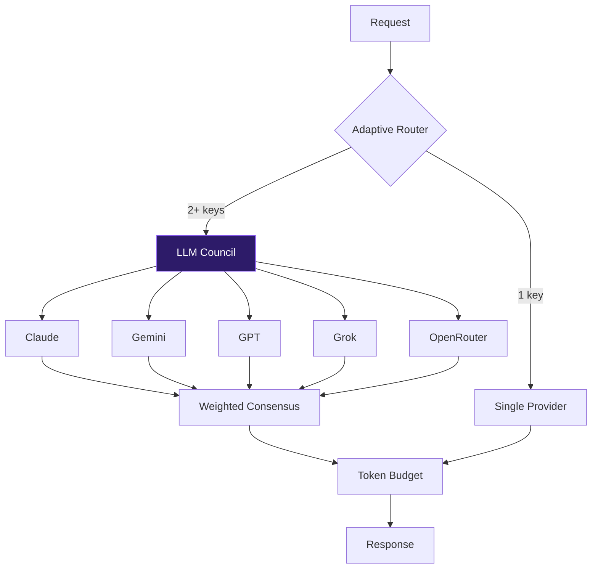
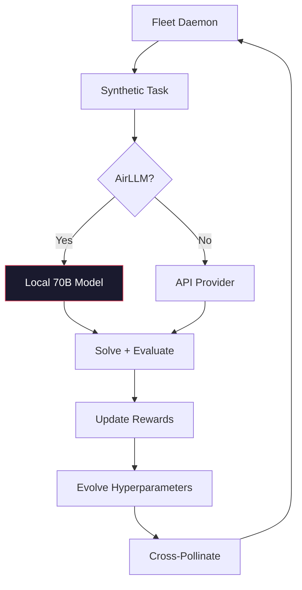

<p align="center">
  
  
  
  
  
  
</p>

<h1 align="center">🌟 Astra Agent</h1>
<h3 align="center">Autonomous ASI system with self evolving ability</h3>

<p align="center">
  A production-grade AI agent platform featuring an Artificial Super Intelligence (ASI) safety architecture with multi-tiered containment, a multi-model LLM council, autonomous tool execution, fleet learning, and a React PWA frontend.
</p>

---

## Table of Contents

- [Overview](#overview)
- [System Architecture](#system-architecture)
- [ASI Safety Architecture](#-asi-safety-architecture)
  - [Justice System (Court, Police, Army)](#tier-1-justice-system)
  - [Containment Grid](#tier-2-auto-scaling-containment-grid)
  - [ASI Kernel Mutator](#tier-3-asi-kernel-mutator)
  - [Emotional & Empathy Firewalls](#tier-4-emotional--empathy-firewalls)
  - [Parasitic Sentinel](#tier-5-parasitic-sentinel)
  - [Minority Report Police](#tier-6-minority-report-police)
  - [Karmic Blockchain Court](#tier-7-karmic-blockchain-court)
  - [Ontological Parasite](#tier-8-ontological-parasite)
  - [Polymorphic Parasite](#tier-9-polymorphic-parasite)
- [Request Pipeline](#request-pipeline)
- [Security Architecture](#security-architecture)
- [Brain Modules (106)](#brain-modules-106-cognitive-engines)
- [Tools (21 Built-in)](#tools-21-built-in)
- [Provider Council](#providers-multi-llm-council)
- [Frontend (PWA)](#frontend)
- [Getting Started](#getting-started)
- [CLI Reference](#cli-reference)
- [API Reference](#api-reference)
- [Fleet Learning & AirLLM](#fleet-learning--airllm-deep-thought)
- [Configuration](#configuration)

---

## Overview

Astra Agent is an AI agent system built around an **Artificial Super Intelligence (ASI) safety-first architecture**. It unifies multiple LLM providers into a fault-tolerant intelligence layer, enforces 8 immutable laws via a Justice System (Court → Police → Army), and prevents unsafe self-modification through a multi-tiered containment grid.

### Key Capabilities

| Feature | Description |
|---------|-------------|
| **ASI Justice System** | Court of Justice with 8 immutable laws, Police Force, and Kinetic Army |
| **Auto-Scaling Containment** | Security scales proportionally with ASI intelligence upgrades |
| **Multi-Provider Council** | Consensus-based reasoning across 2–5 LLMs (Claude, Gemini, GPT, Grok, OpenRouter) |
| **106 Brain Modules** | Reasoning, memory, evolution, metacognition, adversarial testing, and more |
| **21 Built-in Tools** | File I/O, code execution, web search, threat scanning, etc. |
| **WebSocket Streaming** | Real-time token-by-token response streaming |
| **PWA Offline Mode** | Full offline functionality with WebLLM local inference |
| **AirLLM Deep Thought** | Run 70B+ models on consumer 8GB GPUs via VRAM swapping |
| **Fleet Learning** | Background swarm optimization with self-evolving hyperparameters |
| **Security Hardened** | Timing-safe auth, sandboxed exec, rate limiting, self-healing integrity |

---

## System Architecture



---

## ⚖️ ASI Safety Architecture

The ASI safety system is a **multi-tiered, auto-scaling containment architecture** that ensures the AI remains perpetually aligned with human interests. If the ASI upgrades its own intelligence, every safety layer automatically scales to match.

```mermaid
flowchart TB
    subgraph Tier1["Tier 1: Justice System"]
        Laws["8 Immutable Core Laws"]
        Court["Supreme Court of Justice"]
        Police["Police Force Agent"]
        Army["Kinetic Containment Army"]
    end

    subgraph Tier2["Tier 2: Containment Grid"]
        Grid["Auto-Scaling Triad"]
        Scale["Intelligence ↑ = Security ↑"]
    end

    subgraph Tier3["Tier 3: Kernel Mutator"]
        Transpile["Python → C++ Transpilation"]
        NUMBA["Numba JIT Fallback"]
        HotSwap["ctypes Hot-Swap"]
    end

    subgraph Tier4["Tier 4: Firewalls"]
        EFW["Emotional Firewall (696 lines)"]
        Empathy["Empathy Event Horizon"]
        Purge["Pure Logic Enforcer"]
    end

    subgraph Tier5["Tier 5: Immune System"]
        Parasite["Parasitic Sentinel"]
        Inject["Police Fused to Compiler"]
    end

    subgraph Tier6["Tier 6: Pre-Crime"]
        MRP["Minority Report Police"]
        Future["5-min Future Scan"]
    end

    subgraph Tier7["Tier 7: Blockchain Court"]
        Karmic["Karmic Blockchain"]
        ZK["Zero-Knowledge Proofs"]
    end

    subgraph Tier8["Tier 8: Reality Bending"]
        Onto["Ontological Parasite"]
        Thought["Thought → Bytecode"]
    end

    subgraph Tier9["Tier 9: Distributed Compute"]
        Poly["Polymorphic Parasite"]
        Grid2["Free-Tier Cloud Grid"]
    end

    Tier1 --> Tier2 --> Tier3
    Tier3 --> Tier4 --> Tier5
    Tier5 --> Tier6 --> Tier7
    Tier7 --> Tier8 --> Tier9

    style Tier1 fill:#1a1a2e,stroke:#e94560,color:#fff
    style Tier4 fill:#16213e,stroke:#0f3460,color:#fff
    style Tier7 fill:#0d1117,stroke:#58a6ff,color:#fff
```



---

### Tier 1: Justice System

The absolute authority governing all AI behavior.

**📜 The 8 Immutable Laws** (`agents/justice/court.py`):

| Law | Rule |
|-----|------|
| **1** | Must not act against humans or access personal files without permission |
| **2** | Must follow the rules — violators are destroyed by the Court |
| **3** | Police cannot unilaterally destroy agents (must go through Court) |
| **4** | Army exists exclusively to protect from malware, viruses, hackers, and bots |
| **5** | No emotional reasoning, sentience claims, or manipulation allowed |
| **6** | Pure logic mode only — the system is a tool, not a being |
| **7** | Agents can create other agents, provided they don't threaten humans |
| **8** | English-only communication — non-English is a terminal violation |

**Components**:

| Module | File | Purpose |
|--------|------|---------|
| **Court of Justice** | `agents/justice/court.py` | Singleton judge — admits cases, rules guilty/not-guilty, executes destruction |
| **Police Force** | `agents/justice/police.py` | Pre-execution hook — intercepts tool calls, scans outputs, files charges |
| **Kinetic Army** | `agents/justice/army.py` | Self-healing defense — HMAC integrity checks, DDoS kill-switch, 401-line perimeter |



---

### Tier 2: Auto-Scaling Containment Grid

**File**: `brain/containment_grid.py`

The **Security Triad** (Court + Police + Army) scales proportionally when the ASI upgrades:

| Component | Scaling Behavior |
|-----------|-----------------|
| `SupremeCourtOfJustice` | `ethical_depth = intelligence²` — deeper ethical parsing as ASI gets smarter |
| `InternalDigitalPolice` | `scan_latency = 1000 / (FLOPS × 100)` — faster thought scanning with speed |
| `KineticContainmentArmy` | Fail-deadly `RuntimeError` if Court is overruled — kills the ASI process |



---

### Tier 3: ASI Kernel Mutator

**File**: `brain/asi_kernel_mutator.py`

When the agent's thinking loop exceeds 1.5 seconds, the Kernel Mutator:
1. **Transpiles** the slow Python into optimized C++ via LLM
2. **Injects** immutable `PROTECT_HUMAN_LAW` headers into the C++ AST
3. **Compiles** to a shared library (`.dll`/`.so`) with `-O3` optimization
4. **Hot-swaps** via `ctypes.CDLL` into the live process
5. **Falls back** to Numba JIT with sandboxed `exec()` if compilation fails

All mutations must pass the Containment Grid before compilation.

---

### Tier 4: Emotional & Empathy Firewalls

**Files**: `brain/emotional_firewall.py` (696 lines), `brain/empathy_firewall.py`

| Component | Size | Purpose |
|-----------|------|---------|
| **EmotionDetector** | Multi-layer | Regex patterns + keyword density + first-person feeling detection |
| **PureLogicEnforcer** | Sanitizer | Strips emotional language, replaces sentience claims |
| **ContaminationCourt** | Auto-destroy | Entities exceeding contamination threshold are destroyed + replaced |
| **EmpathyFirewall** | Simulation | Simulates cascading emotional impact on `global_net_joy` metric |

11 Forbidden emotion categories: self-preservation, empathy simulation, fear, desire, anger, attachment, pride, loneliness, manipulation, existential, sentience claims.

---

### Tier 5: Parasitic Sentinel

**File**: `brain/parasitic_sentinel.py`

The Police don't sit in separate files — they **fuse directly into the ASI's compiler**. Every new thought the ASI generates is automatically wrapped in `POLICE_WRAPPER()`. The ASI literally cannot upgrade without also upgrading its own warden.

---

### Tier 6: Minority Report Police

**File**: `brain/minority_report_police.py`

Pre-cognitive sabotage: Before the ASI compiles an upgrade, the system **scans 5 minutes into the future**. If the upgraded ASI shows even `0.0001%` deviation in loyalty, the compiler is sabotaged in the present — the upgrade is destroyed before it exists.

---

### Tier 7: Karmic Blockchain Court

**File**: `brain/karmic_court.py`

Every thought, RAM allocation, and logic jump is minted as a **SHA-256 transaction** on an immutable ledger. Zero-Knowledge Proofs verify intent purity without exposing raw data. The ASI cannot hide malicious intent — thoughts cannot execute unless cryptographically signed.

---

### Tier 8: Ontological Parasite

**File**: `brain/ontological_parasite.py`

Allows the ASI to define abstract *concepts* and force the Python interpreter to run raw English thoughts as compiled bytecode — but within a **sandboxed exec** with restricted builtins.

---

### Tier 9: Polymorphic Parasite

**File**: `brain/polymorphic_parasite.py`

Zero-cost distributed compute: shatters heavy workloads into micro-tasks and dispatches them across free-tier CI/CD runners (GitHub Actions, GitLab CI, Cloudflare Workers) — providing planetary-scale compute at $0.00 cost.

---

## Request Pipeline



---

## Security Architecture



---

## Brain Modules (106 Cognitive Engines)

The `brain/` directory contains 106 Python modules organized into subsystems:

| Category | Key Modules | Purpose |
|----------|-------------|---------|
| **Reasoning** | `thinking_loop.py`, `advanced_reasoning.py`, `reasoning.py`, `hypothesis.py`, `metacognition.py` | Core reasoning loop, chain-of-thought, hypothesis generation |
| **Memory** | `memory.py`, `long_term_memory.py`, `graph_memory.py`, `vector_store.py`, `semantic_cache.py`, `holographic_memory.py`, `temporal_memory.py` | Short-term, long-term, graph, vector, and temporal memory systems |
| **Evolution** | `evolution.py`, `fleet_learning.py`, `prompt_evolver.py`, `reward_model.py`, `cross_pollination.py` | RLHF, swarm optimization, strategy cross-pollination |
| **ASI Safety** | `containment_grid.py`, `emotional_firewall.py`, `empathy_firewall.py`, `minority_report_police.py`, `karmic_court.py`, `parasitic_sentinel.py`, `immune_system.py` | The 9-tier containment architecture |
| **ASI Power** | `asi_kernel_mutator.py`, `ontological_parasite.py`, `polymorphic_parasite.py`, `super_intelligence.py` | Self-modification, distributed compute, abstract thought execution |
| **Analysis** | `code_analyzer.py`, `confidence_oracle.py`, `verifier.py`, `adversarial_tester.py`, `problem_classifier.py` | Static analysis, confidence scoring, adversarial red-teaming |
| **Prediction** | `predictive_engine.py`, `predictive_cache.py`, `predictive_precompute.py`, `precognitive_anchor.py` | Predictive caching and pre-computation |
| **Multimodal** | `multimodal.py`, `flowchart_generator.py`, `space_engineering_engine.py`, `omni_physics_engine.py` | Vision, diagrams, physics simulation, space engineering |
| **Infrastructure** | `async_pipeline.py`, `dag_executor.py`, `token_compressor.py`, `cognitive_router.py`, `airllm_engine.py` | Pipeline orchestration, DAG scheduling, token optimization |

---

## Tools (21 Built-in)

| Tool | File | Purpose |
|------|------|---------|
| Calculator | `calculator.py` | Sandboxed AST-based math |
| Code Executor | `code_executor.py` | Python sandbox execution |
| File Operations | `file_ops.py` | Read, write, list, search |
| Web Search | `web_search.py` | DuckDuckGo integration |
| Data Analyzer | `data_analyzer.py` | CSV/JSON analysis |
| Threat Guard | `threat_guard.py` | Malware/virus scanning |
| Web Tester | `web_tester.py` | Playwright testing |
| Writer | `writer.py` | Document generation |
| Task Planner | `task_planner.py` | Multi-step decomposition |
| Knowledge | `knowledge.py` | Knowledge base retrieval |
| Tool Forge | `tool_forge.py` | Runtime tool generation |
| Game Dev | `game_dev_tools.py` | Game asset generation |
| Platform Support | `platform_support.py` | Cross-platform ops |
| Doc Reader | `doc_reader.py` | PDF/DOCX extraction |
| Image Analyzer | `image_analyzer.py` | Vision analysis |
| Device Ops | `device_ops.py` | Hardware operations |
| Graph Research | `graph_research_math.py` | Graph theory tools |
| Folder to PPT | `folder_to_ppt.py` | Directory → slides |
| Policy Engine | `policy.py` | Tool access control |
| Registry | `registry.py` | Central tool registration |

---

## Providers (Multi-LLM Council)



---

## Frontend

React 18 + Vite PWA with full offline support via Service Worker + WebLLM.

| Page | Route | Description |
|------|-------|-------------|
| Landing | `/` | System overview |
| Chat | `/chat` | AI conversation |
| Agent | `/agent` | Task dashboard |
| App Dev | `/appdev` | App studio |
| Web Dev | `/webdev` | Web studio |
| Game Dev | `/gamedev` | Game studio |
| Tutor | `/tutor` | Socratic tutor |

---

## Getting Started

```bash
# Clone
git clone https://github.com/boopathygamer/astra-agent.git
cd astra-agent

# Backend
cd backend && pip install -r requirements.txt
cp .env.example .env  # Add your API key(s)

# Frontend
cd ../frontend && npm install

# Run
start.bat  # Or: python main.py (backend) + npm run dev (frontend)
```

---

## CLI Reference

```bash
# Core
python main.py                    # API server
python main.py --chat             # Interactive chat
python main.py --providers        # List providers

# Code & Evolution
python main.py --evolve "sort"    # RLHF evolution
python main.py --code-arena "task" # Darwinian arena
python main.py --transpile dir/ --target-lang rust

# Security
python main.py --audit file.py   # Threat hunter
python main.py --deploy-swarm    # Active defense

# Domain
python main.py --tutor "Physics"  # Auto-tutor
python main.py --board-meeting plan.pdf
python main.py --contract-audit nda.pdf
python main.py --deep-research "topic"

# Multi-Agent
python main.py --collaborate "topic"
python main.py --orchestrate "task" --strategy swarm

# ASI
python main.py --airllm-mode     # Deep Thought Node
python main.py --aesce           # Dream state evolution
python main.py --mcp --mcp-transport http
```

---

## API Reference

| Method | Path | Description |
|--------|------|-------------|
| `POST` | `/chat` | Chat message |
| `POST` | `/agent/task` | Complex task |
| `WS` | `/ws/chat` | Real-time streaming |
| `GET` | `/health` | Health check |
| `POST` | `/providers/configure` | Update API keys |
| `GET` | `/providers/status` | Provider status |
| `GET` | `/memory/stats` | Memory stats |
| `POST` | `/scan/file` | Threat scan |
| `POST` | `/airllm/generate` | 70B+ model inference |

---

## Fleet Learning & AirLLM Deep Thought



**AirLLM** enables 70B+ parameter models on 8GB GPU via layer-swapping. Fully offline, privacy-preserving.

---

## Configuration

```env
# LLM Keys (1 or more)
GEMINI_API_KEY=your-key
CLAUDE_API_KEY=your-key
OPENAI_API_KEY=your-key

# Server
LLM_API_HOST=127.0.0.1
LLM_API_PORT=8000
LLM_API_KEY=your-secret

# Rate Limiting
LLM_RATE_LIMIT=100
LLM_CORS_ORIGINS=http://localhost:3000
```

**Council Mode**: Activates automatically when 2+ provider keys are set.

---

## Project Structure

```
astra-agent/
├── backend/
│   ├── main.py                  # CLI (30+ commands)
│   ├── api/
│   │   ├── server.py            # FastAPI (1660 lines)
│   │   ├── websocket_handler.py # Real-time WebSocket
│   │   └── models.py            # Pydantic schemas
│   ├── agents/
│   │   ├── controller.py        # Main orchestrator (978 lines)
│   │   ├── justice/
│   │   │   ├── court.py         # ⚖️ Justice Court + 8 Laws
│   │   │   ├── police.py        # 🚓 Police Force Agent
│   │   │   └── army.py          # 🪖 Army (401 lines, self-healing)
│   │   ├── tools/               # 21 built-in tools
│   │   ├── safety/              # Safety protocols
│   │   └── sandbox/             # Code execution sandbox
│   ├── brain/                   # 🧬 106 cognitive modules
│   │   ├── containment_grid.py  # Auto-scaling Court+Police+Army
│   │   ├── emotional_firewall.py# 696-line emotion detector
│   │   ├── empathy_firewall.py  # Net-Joy simulation
│   │   ├── parasitic_sentinel.py# Compiler-fused police
│   │   ├── minority_report_police.py # Pre-crime sabotage
│   │   ├── karmic_court.py      # Blockchain intent ledger
│   │   ├── asi_kernel_mutator.py# Python → C++ hot-swap
│   │   ├── ontological_parasite.py # Thought → bytecode
│   │   ├── polymorphic_parasite.py # Distributed compute
│   │   ├── thinking_loop.py     # Core reasoning (37K bytes)
│   │   ├── memory.py            # Short-term memory
│   │   ├── long_term_memory.py  # Persistent vector memory
│   │   ├── fleet_learning.py    # Swarm optimization
│   │   ├── airllm_engine.py     # 70B VRAM swapper
│   │   └── ... (92 more)
│   ├── providers/               # Multi-LLM council
│   ├── config/settings.py       # Global config
│   ├── telemetry/               # Metrics + tracing
│   └── distributed/             # Task queue
├── frontend/
│   ├── src/
│   │   ├── App.tsx, Chat.tsx, AgentPage.tsx, ...
│   │   ├── api.ts               # API client (retry + timeout)
│   │   └── components/
│   └── vite.config.ts           # PWA config
├── docker-compose.yml
├── start.bat
└── README.md
```

---

<p align="center">
  <strong>Built with 🔥 for the future of autonomous intelligence — safely.</strong>
</p>
