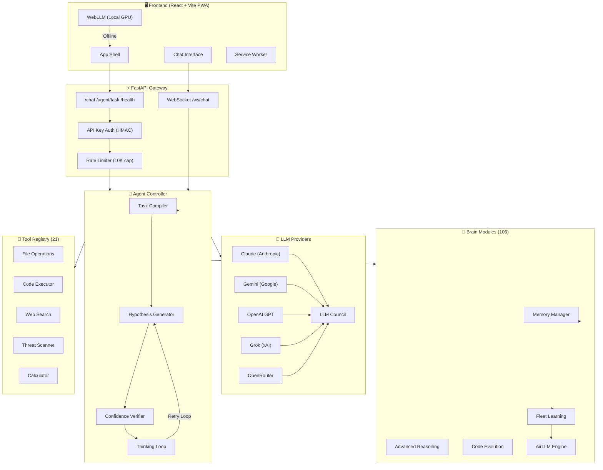
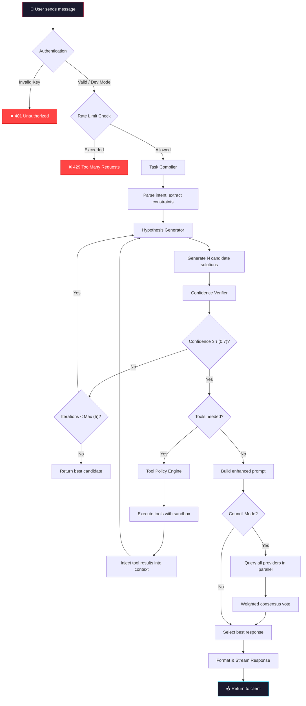
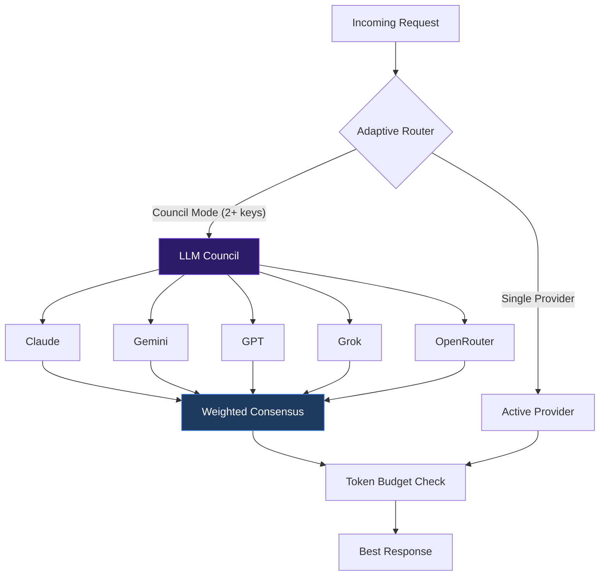
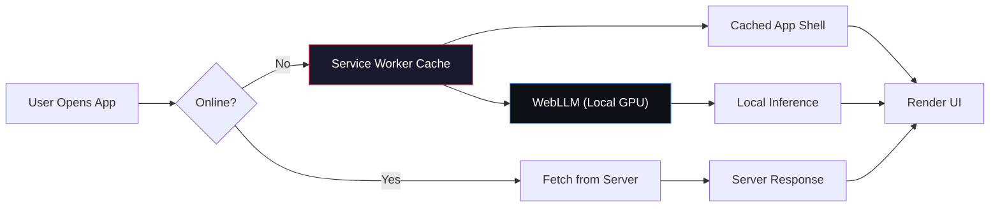
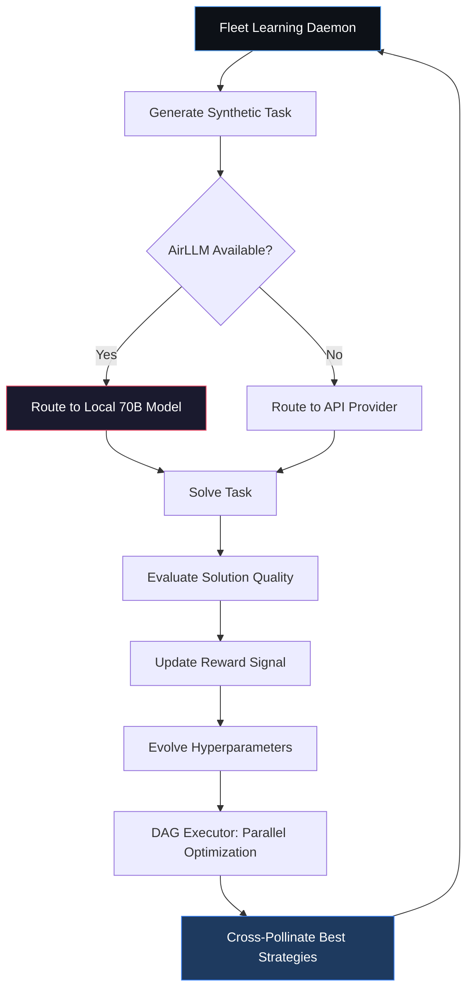
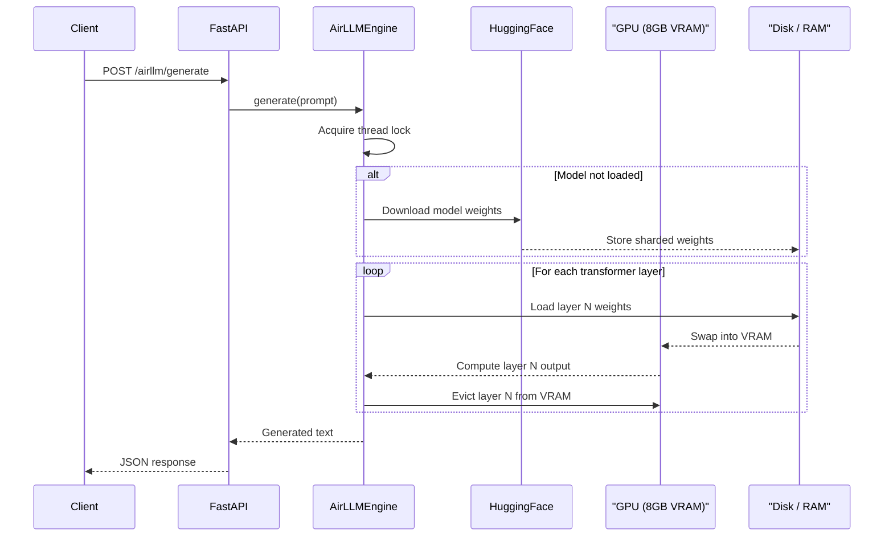

<p align="center">
  
  
  
  
  
  
</p>

<h1 align="center">🌟 Astra Agent</h1>
<h3 align="center">Universal Multi-Model AI Agent System with Autonomous Reasoning</h3>

<p align="center">
  A production-grade AI agent platform that unifies multiple LLM providers into a single, fault-tolerant intelligence layer. Featuring autonomous tool use, council-based consensus, fleet learning, real-time streaming, and a React-based PWA frontend.
</p>

---

## Table of Contents

- [Overview](#overview)
- [System Architecture](#system-architecture)
- [Request Pipeline](#request-pipeline)
- [Security Architecture](#security-architecture)
- [Project Structure](#project-structure)
- [Backend Modules](#backend-modules)
- [Frontend](#frontend)
- [Getting Started](#getting-started)
- [CLI Reference](#cli-reference)
- [API Reference](#api-reference)
- [Fleet Learning & Self-Evolution](#fleet-learning--self-evolution)
- [AirLLM Deep Thought Engine](#airllm-deep-thought-engine)
- [Configuration](#configuration)

---

## Overview

Astra Agent is a multi-model AI system designed for agentic reasoning. It orchestrates tasks across multiple LLM providers (Gemini, Claude, GPT, Grok, OpenRouter), applies a multi-hypothesis verification loop, executes tools autonomously, and evolves its own strategies through fleet learning.

### Key Capabilities

| Feature | Description |
|---------|-------------|
| **Multi-Provider Council** | Consensus-based reasoning across 2–5 LLMs |
| **21 Built-in Tools** | File I/O, code execution, web search, threat scanning, etc. |
| **Autonomous Agent Loop** | Compile → Hypothesize → Verify → Execute → Learn |
| **WebSocket Streaming** | Real-time token-by-token response streaming |
| **PWA Offline Mode** | Full offline functionality with WebLLM local inference |
| **AirLLM Deep Thought** | Run 70B+ models on consumer 8GB GPUs via VRAM swapping |
| **Fleet Learning** | Background swarm optimization with self-evolving hyperparameters |
| **MCP Protocol** | Model Context Protocol server for external IDE integration |
| **Security Hardened** | Timing-safe auth, sandboxed execution, rate limiting, threat scanning |

---

## System Architecture



---

## Request Pipeline

The following flowchart shows how a single user request is processed:



---

## Security Architecture

```mermaid
flowchart LR
    subgraph Perimeter["🛡️ Perimeter Defense"]
        CORS["CORS Validation"]
        Size["Request Size Limit (1MB)"]
        HMAC["Timing-Safe API Key (HMAC)"]
        Rate["Rate Limiter (100/min, 10K IP cap)"]
    end

    subgraph Runtime["🔒 Runtime Security"]
        Sandbox["Hardened Code Executor"]
        Policy["Tool Policy Engine"]
        Loop["Loop Detection Circuit Breaker"]
        Threat["Threat Scanner (Entropy + Signature)"]
    end

    subgraph ASI["⚖️ ASI Containment"]
        Court["Court of Justice"]
        Police["Minority Report Police"]
        Army["Containment Grid"]
        Firewall["Emotional Firewall"]
    end

    CORS --> HMAC --> Rate --> Size --> Runtime
    Sandbox --> Policy --> Loop --> Threat
    Threat --> ASI
```



---

## Project Structure

```
astra-agent/
├── backend/
│   ├── main.py                  # CLI entry point (30+ commands)
│   ├── api/
│   │   ├── server.py            # FastAPI app (1600+ lines)
│   │   ├── models.py            # Pydantic request/response schemas
│   │   ├── streaming.py         # SSE streaming logic
│   │   └── websocket_handler.py # Real-time WebSocket chat
│   ├── core/
│   │   ├── model_providers.py   # Universal LLM provider with retry
│   │   ├── model_router.py      # Intelligent model routing
│   │   └── streaming.py         # Token coalescing engine
│   ├── agents/
│   │   ├── controller.py        # Main agent orchestrator (978 lines)
│   │   ├── orchestrator.py      # Multi-agent orchestration strategies
│   │   ├── code_arena.py        # Darwinian code evolution
│   │   ├── compiler.py          # Task → structured spec
│   │   ├── generator.py         # Hypothesis generation
│   │   ├── tools/               # 21 built-in tool modules
│   │   ├── safety/              # Containment & safety protocols
│   │   ├── sessions/            # Session persistence & compaction
│   │   └── sandbox/             # Hardened code execution
│   ├── brain/                   # 106 cognitive modules
│   │   ├── thinking_loop.py     # Core reasoning loop
│   │   ├── memory.py            # Short-term memory
│   │   ├── long_term_memory.py  # Persistent vector memory
│   │   ├── fleet_learning.py    # Swarm optimization daemon
│   │   ├── airllm_engine.py     # 70B model VRAM swapper
│   │   ├── verifier.py          # Tri-shield confidence verifier
│   │   ├── code_analyzer.py     # Static analysis engine
│   │   ├── emotional_firewall.py # ASI emotional containment
│   │   └── ...                  # 98 more cognitive modules
│   ├── providers/
│   │   ├── llm_council.py       # Multi-LLM consensus engine
│   │   ├── council_providers.py # Provider factory
│   │   ├── token_budget.py      # Token budget management
│   │   └── adaptive_router.py   # Latency-aware routing
│   ├── config/
│   │   └── settings.py          # Global dataclass configs
│   ├── telemetry/               # Metrics, tracing, log export
│   ├── distributed/             # Task queue for scaling
│   └── schemas/                 # Pydantic data schemas
│
├── frontend/
│   ├── src/
│   │   ├── App.tsx              # Landing page + router
│   │   ├── Chat.tsx             # Main AI chat interface
│   │   ├── AgentPage.tsx        # Agent task dashboard
│   │   ├── AppDevPage.tsx       # App development studio
│   │   ├── WebDevPage.tsx       # Web development studio
│   │   ├── GameDevPage.tsx      # Game development studio
│   │   ├── TutorPage.tsx        # Socratic auto-tutor
│   │   ├── api.ts               # API client with retry + timeout
│   │   └── components/          # Shared UI components
│   ├── vite.config.ts           # Vite + PWA configuration
│   └── package.json
│
├── docker-compose.yml
├── start.bat
└── README.md
```

---

## Backend Modules

### Brain (106 Cognitive Modules)

The brain is the core intelligence layer. Key subsystems:

```mermaid
graph LR
    subgraph Reasoning["🧠 Reasoning"]
        TL["Thinking Loop"]
        AR["Advanced Reasoning"]
        MC["Metacognition"]
        HG["Hypothesis Generator"]
    end

    subgraph Memory["💾 Memory"]
        STM["Short-Term Memory"]
        LTM["Long-Term Memory"]
        VM["Vector Store"]
        GM["Graph Memory"]
        SC["Semantic Cache"]
    end

    subgraph Evolution["🧬 Evolution"]
        FL["Fleet Learning"]
        CE["Code Evolution"]
        PE["Prompt Evolver"]
        RM["Reward Model"]
    end

    subgraph Safety["🛡️ Safety"]
        EF["Emotional Firewall"]
        CG["Containment Grid"]
        IS["Immune System"]
        ZK["ZK-Proofs"]
    end

    Reasoning --> Memory
    Memory --> Evolution
    Evolution --> Safety
```



### Tools (21 Built-in)

| Tool | File | Purpose |
|------|------|---------|
| Calculator | `calculator.py` | Sandboxed AST-based math evaluation |
| Code Executor | `code_executor.py` | Python execution with security sandbox |
| File Operations | `file_ops.py` | Read, write, list, search files |
| Web Search | `web_search.py` | DuckDuckGo search integration |
| Data Analyzer | `data_analyzer.py` | CSV/JSON analysis & visualization |
| Threat Guard | `threat_guard.py` | Real-time malware/virus scanning |
| Web Tester | `web_tester.py` | Playwright-based website testing |
| Writer | `writer.py` | Structured document generation |
| Task Planner | `task_planner.py` | Multi-step task decomposition |
| Knowledge | `knowledge.py` | Knowledge base retrieval |
| Tool Forge | `tool_forge.py` | Runtime dynamic tool generation |
| Game Dev Tools | `game_dev_tools.py` | Game asset & logic generation |
| Platform Support | `platform_support.py` | Cross-platform operations |
| Doc Reader | `doc_reader.py` | PDF/DOCX document extraction |
| Image Analyzer | `image_analyzer.py` | Vision-based image analysis |
| Device Ops | `device_ops.py` | System hardware operations |
| Graph Research | `graph_research_math.py` | Graph theory & research tools |
| Folder to PPT | `folder_to_ppt.py` | Directory → presentation converter |
| Policy Engine | `policy.py` | Tool access policy enforcement |
| Registry | `registry.py` | Central tool registration |
| Init | `__init__.py` | Package initialization |

### Providers (Multi-LLM Council)



---

## Frontend

The frontend is a React 18 application built with **Vite** and styled with custom CSS. It ships as a **Progressive Web App (PWA)** for full offline functionality.

### Pages

| Page | Route | Description |
|------|-------|-------------|
| Landing | `/` | Hero page with system overview |
| Chat | `/chat` | Main AI conversation interface |
| Agent | `/agent` | Complex task submission dashboard |
| App Dev | `/appdev` | App development studio |
| Web Dev | `/webdev` | Web development studio |
| Game Dev | `/gamedev` | Game development studio |
| Tutor | `/tutor` | Socratic auto-tutor |

### Offline Architecture



---

## Getting Started

### Prerequisites

- **Python 3.11+**
- **Node.js 18+** and npm
- At least one LLM API key (Gemini, Claude, OpenAI, Grok, or OpenRouter)

### Installation

```bash
# Clone the repository
git clone https://github.com/boopathygamer/astra-agent.git
cd astra-agent

# Backend setup
cd backend
pip install -r requirements.txt
cp .env.example .env
# Edit .env and add your API key(s)

# Frontend setup
cd ../frontend
npm install
```

### Running

```bash
# Option 1: Start both servers (Windows)
start.bat

# Option 2: Manual startup
# Terminal 1 — Backend
cd backend
python main.py

# Terminal 2 — Frontend
cd frontend
npm run dev
```

The backend will start at `http://localhost:8000` and the frontend at `http://localhost:3000`.

---

## CLI Reference

```bash
# ── Core Modes ──
python main.py                          # Start API server
python main.py --chat                   # Interactive CLI chat
python main.py --providers              # List configured providers

# ── Code & Evolution ──
python main.py --evolve "sort algorithm"           # RLHF code evolution
python main.py --code-arena "optimization problem" # Darwinian code arena
python main.py --transpile legacy/ --target-lang rust  # Code transpiler

# ── Security ──
python main.py --audit file.py          # Threat hunter audit
python main.py --scan ./project         # Virus / malware scanner
python main.py --deploy-swarm           # Active defense honeypots

# ── Domain Features ──
python main.py --tutor "Quantum Physics"        # Socratic auto-tutor
python main.py --board-meeting plan.pdf         # Devil's advocate
python main.py --syndicate draft.txt            # Content syndication
python main.py --organize ~/Downloads           # Digital archivist
python main.py --contract-audit nda.pdf         # Legal clause hunter
python main.py --deep-research "topic"          # Deep web intelligence

# ── Multi-Agent ──
python main.py --collaborate "topic"             # Multi-agent debate
python main.py --orchestrate "task" --strategy swarm  # Orchestrator
python main.py --swarm "complex task"            # Swarm intelligence

# ── Advanced ──
python main.py --airllm-mode            # AirLLM Deep Thought Node
python main.py --aesce                  # Auto-evolution dream state
python main.py --mcp --mcp-transport http --mcp-port 8080  # MCP server
```

---

## API Reference

### Core Endpoints

| Method | Path | Description |
|--------|------|-------------|
| `POST` | `/chat` | Send a chat message |
| `POST` | `/agent/task` | Submit a complex agent task |
| `GET` | `/health` | System health check |
| `WS` | `/ws/chat` | Real-time WebSocket chat |

### Provider Management

| Method | Path | Description |
|--------|------|-------------|
| `POST` | `/providers/configure` | Update API keys at runtime |
| `GET` | `/providers/status` | View active providers & council mode |

### Memory & Sessions

| Method | Path | Description |
|--------|------|-------------|
| `GET` | `/memory/stats` | Memory diary statistics |
| `POST` | `/memory/recall` | Query memory for past context |
| `GET` | `/sessions` | List all conversation sessions |
| `GET` | `/memory/long-term` | Long-term memory retrieval |

### Security & Scanning

| Method | Path | Description |
|--------|------|-------------|
| `POST` | `/scan/file` | Scan a file for threats |
| `POST` | `/scan/directory` | Scan a directory recursively |
| `POST` | `/scan/url` | Scan a URL for threats |
| `POST` | `/scan/quarantine` | Quarantine a suspicious file |
| `POST` | `/scan/destroy` | Permanently delete a threat |

### AirLLM Deep Thought

| Method | Path | Description |
|--------|------|-------------|
| `POST` | `/airllm/generate` | Generate response from 70B+ model |

---

## Fleet Learning & Self-Evolution

The system runs a background **Swarm Optimization Daemon** that continually improves its own performance:



---

## AirLLM Deep Thought Engine

AirLLM enables running **massive 70B+ parameter models** on consumer GPUs (8GB VRAM) through aggressive layer-swapping. This allows the system to operate as a fully offline, privacy-preserving intelligence node.



---

## Configuration

### Environment Variables

Create a `.env` file in the `backend/` directory:

```env
# ── LLM Provider Keys (set 1 or more) ──
GEMINI_API_KEY=your-gemini-key
CLAUDE_API_KEY=your-claude-key
OPENAI_API_KEY=your-openai-key
GROK_API_KEY=your-grok-key
OPENROUTER_API_KEY=your-openrouter-key

# ── Server Config ──
LLM_API_HOST=127.0.0.1
LLM_API_PORT=8000
LLM_API_KEY=your-secret-api-key    # Protects endpoints

# ── Rate Limiting ──
LLM_RATE_LIMIT=100                 # Requests per minute

# ── CORS ──
LLM_CORS_ORIGINS=http://localhost:3000,http://localhost:8080

# ── Token Budget ──
TOKEN_DAILY_LIMIT=1000000
TOKEN_MONTHLY_LIMIT=30000000

# ── SSL (Optional) ──
SSL_ENABLED=true
SSL_CERTFILE=certs/server.crt
SSL_KEYFILE=certs/server.key
```

### Council Mode

When **2 or more** provider API keys are configured, the system automatically activates **Council Mode** — all providers are queried in parallel and the best response is selected via weighted consensus voting.

---

<p align="center">
  <strong>Built with 🔥 for the future of autonomous intelligence.</strong>
</p>
