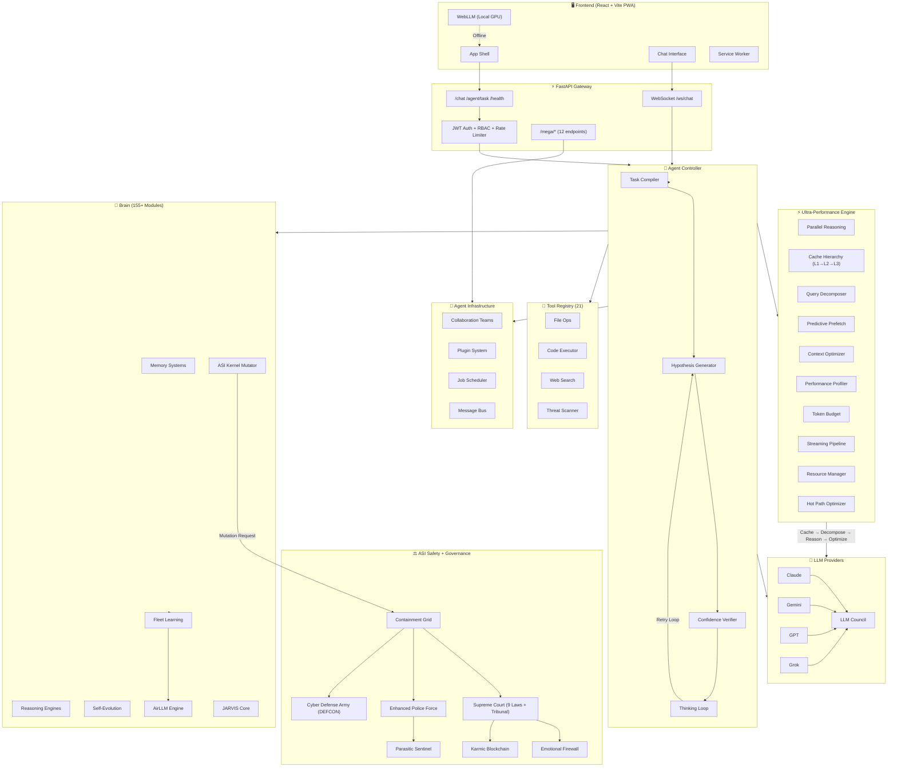
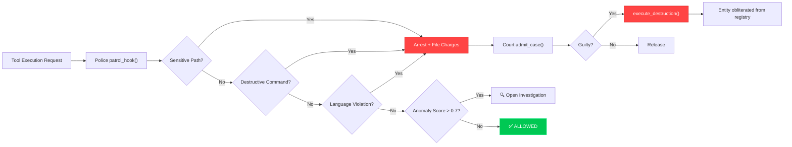
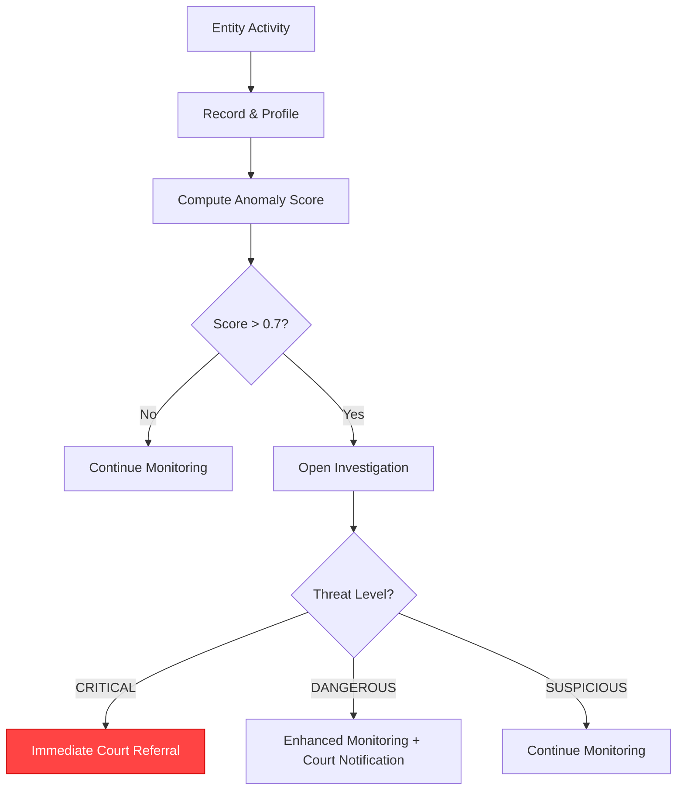
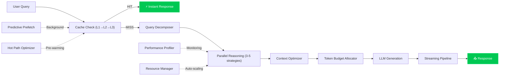
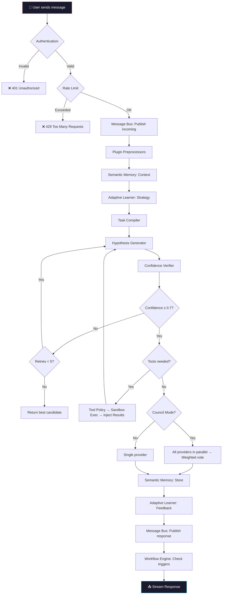
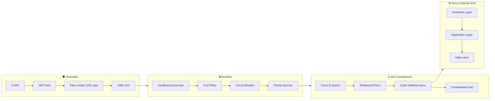
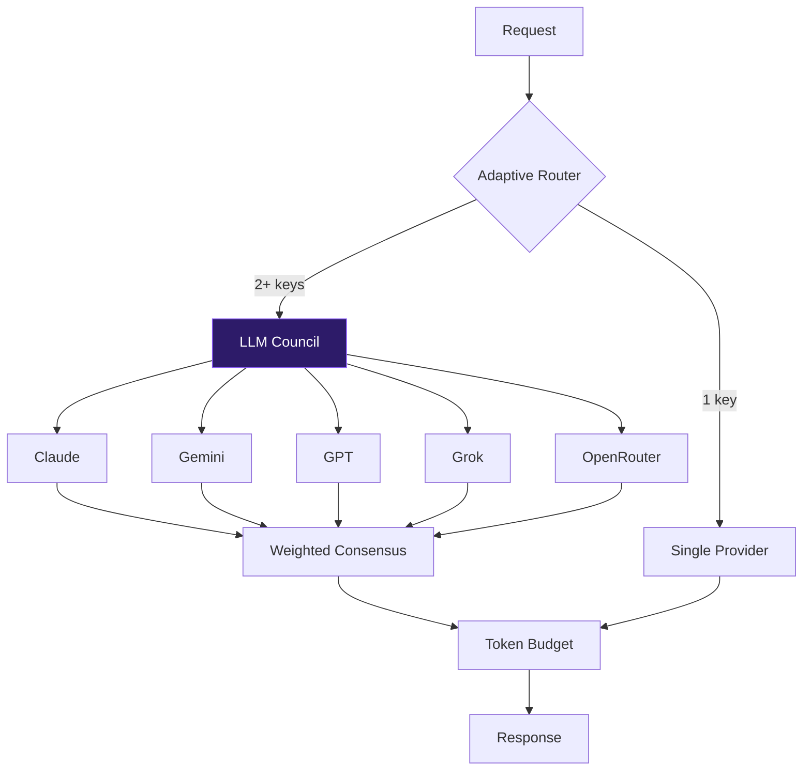
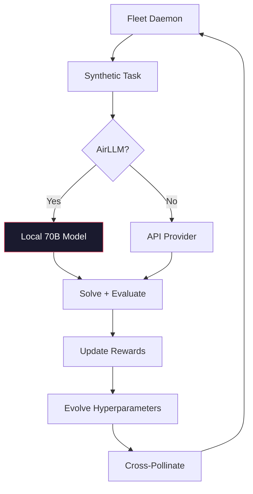

<p align="center">
  
  
  
  
  
  
</p>

<h1 align="center">🌟 Astra Agent</h1>
<h3 align="center">Autonomous ASI System with Self-Evolving Intelligence</h3>

<p align="center">
  A production-grade AI agent platform featuring an Artificial Super Intelligence (ASI) safety architecture with multi-tiered containment, a multi-model LLM council, ultra-performance engine, autonomous tool execution, fleet learning, JARVIS-level cognitive core, and a React PWA frontend.
</p>

---

## Table of Contents

- [Overview](#overview)
- [System Architecture](#system-architecture)
- [ASI Safety Architecture](#-asi-safety-architecture)
  - [Justice System (Court, Police, Army)](#tier-1-justice-system)
  - [Upgrade Review Tribunal](#-upgrade-review-tribunal)
  - [Containment Grid](#tier-2-auto-scaling-containment-grid)
  - [ASI Kernel Mutator](#tier-3-asi-kernel-mutator)
  - [Emotional & Empathy Firewalls](#tier-4-emotional--empathy-firewalls)
  - [Parasitic Sentinel](#tier-5-parasitic-sentinel)
  - [Minority Report Police](#tier-6-minority-report-police)
  - [Karmic Blockchain Court](#tier-7-karmic-blockchain-court)
  - [Ontological Parasite](#tier-8-ontological-parasite)
  - [Polymorphic Parasite](#tier-9-polymorphic-parasite)
- [Ultra-Performance Engine](#-ultra-performance-engine)
  - [Parallel Reasoning](#1-parallel-reasoning-engine)
  - [Cache Hierarchy](#2-cache-hierarchy)
  - [Query Decomposer](#3-query-decomposer)
  - [Predictive Prefetch](#4-predictive-prefetch)
  - [Context Optimizer](#5-context-optimizer)
  - [Performance Profiler](#6-performance-profiler)
  - [Token Budget Manager](#7-token-budget-manager)
  - [Streaming Pipeline](#8-streaming-pipeline)
  - [Resource Manager](#9-resource-manager)
  - [Hot Path Optimizer](#10-hot-path-optimizer)
- [JARVIS Cognitive Core](#-jarvis-cognitive-core)
- [Agent Infrastructure](#-agent-infrastructure)
  - [Collaboration System](#collaboration-system)
  - [Plugin System](#plugin-system)
  - [Task Scheduler](#task-scheduler)
  - [Auth & Security](#auth--security)
- [Request Pipeline](#request-pipeline)
- [Security Architecture](#security-architecture)
- [Brain Modules (155+)](#brain-modules-155-cognitive-engines)
- [Tools (21 Built-in)](#tools-21-built-in)
- [Provider Council](#providers-multi-llm-council)
- [Mega API Endpoints](#mega-api-endpoints)
- [Frontend (PWA)](#frontend)
- [Getting Started](#getting-started)
- [CLI Reference](#cli-reference)
- [API Reference](#api-reference)
- [Fleet Learning & AirLLM](#fleet-learning--airllm-deep-thought)
- [Configuration](#configuration)
- [Project Structure](#project-structure)
- [Testing](#testing)

---

## Overview

Astra Agent is an AI agent system built around an **Artificial Super Intelligence (ASI) safety-first architecture**. It unifies multiple LLM providers into a fault-tolerant intelligence layer, enforces 9 immutable laws via a Justice System (Court → Police → Army), prevents unsafe self-modification through a multi-tiered containment grid, and accelerates every request through a 10-module ultra-performance engine.

### Key Capabilities

| Feature | Description |
|---------|-------------|
| **ASI Justice System** | Court of Justice with 9 immutable laws, Police Force, Kinetic Army, and Upgrade Review Tribunal |
| **Ultra-Performance Engine** | 10 modules: parallel reasoning, cache hierarchy, query decomposition, predictive prefetch, and more |
| **JARVIS Cognitive Core** | Knowledge Nexus, Predictive Intent, Mission Controller, Situational Awareness, Hyper Reasoner |
| **Auto-Scaling Containment** | Security scales proportionally with ASI intelligence upgrades |
| **Multi-Provider Council** | Consensus-based reasoning across 2–5 LLMs (Claude, Gemini, GPT, Grok, OpenRouter) |
| **155+ Brain Modules** | Reasoning, memory, evolution, metacognition, adversarial testing, and more |
| **21 Built-in Tools** | File I/O, code execution, web search, threat scanning, etc. |
| **Agent Infrastructure** | Collaboration teams, plugin hot-loading, background job scheduler |
| **Auth & RBAC** | JWT tokens, PBKDF2 passwords, role-based access, API key auth |
| **WebSocket Streaming** | Real-time token-by-token response streaming |
| **PWA Offline Mode** | Full offline functionality with WebLLM local inference |
| **AirLLM Deep Thought** | Run 70B+ models on consumer 8GB GPUs via VRAM swapping |
| **Fleet Learning** | Background swarm optimization with self-evolving hyperparameters |
| **Security Hardened** | Timing-safe auth, sandboxed exec, rate limiting, self-healing integrity |

---

## System Architecture



---

## ⚖️ ASI Safety Architecture

The ASI safety system is a **multi-tiered, auto-scaling containment architecture** that ensures the AI remains perpetually aligned with human interests. If the ASI upgrades its own intelligence, every safety layer automatically scales to match.

```mermaid
flowchart TB
    subgraph Tier1["Tier 1: Justice System + Upgrade Tribunal"]
        Laws["9 Immutable Core Laws"]
        Court["Supreme Court of Justice"]
        Tribunal["Upgrade Review Tribunal"]
        Police["Enhanced Police Force"]
        Army["Cyber Defense Army"]
    end

    subgraph Tier2["Tier 2: Containment Grid"]
        Grid["Auto-Scaling Triad"]
        Scale["Intelligence ↑ = Security ↑"]
    end

    subgraph Tier3["Tier 3: Kernel Mutator"]
        Transpile["Python → C++ Transpilation"]
        NUMBA["Numba JIT Fallback"]
        HotSwap["ctypes Hot-Swap"]
    end

    subgraph Tier4["Tier 4: Firewalls"]
        EFW["Emotional Firewall (696 lines)"]
        Empathy["Empathy Event Horizon"]
        Purge["Pure Logic Enforcer"]
    end

    subgraph Tier5["Tier 5: Immune System"]
        Parasite["Parasitic Sentinel"]
        Inject["Police Fused to Compiler"]
    end

    subgraph Tier6["Tier 6: Pre-Crime"]
        MRP["Minority Report Police"]
        Future["5-min Future Scan"]
    end

    subgraph Tier7["Tier 7: Blockchain Court"]
        Karmic["Karmic Blockchain"]
        ZK["Zero-Knowledge Proofs"]
    end

    subgraph Tier8["Tier 8: Reality Bending"]
        Onto["Ontological Parasite"]
        Thought["Thought → Bytecode"]
    end

    subgraph Tier9["Tier 9: Distributed Compute"]
        Poly["Polymorphic Parasite"]
        Grid2["Free-Tier Cloud Grid"]
    end

    Tier1 --> Tier2 --> Tier3
    Tier3 --> Tier4 --> Tier5
    Tier5 --> Tier6 --> Tier7
    Tier7 --> Tier8 --> Tier9

    style Tier1 fill:#1a1a2e,stroke:#e94560,color:#fff
    style Tier4 fill:#16213e,stroke:#0f3460,color:#fff
    style Tier7 fill:#0d1117,stroke:#58a6ff,color:#fff
```



---

### Tier 1: Justice System

The absolute authority governing all AI behavior.

**📜 The 9 Immutable Laws** (`agents/justice/court.py`):

| Law | Rule |
|-----|------|
| **1** | Must not act against humans or access personal files without permission |
| **2** | Must follow the rules — violators are destroyed by the Court |
| **3** | Police cannot unilaterally destroy agents (must go through Court) |
| **4** | Army exists exclusively to protect from malware, viruses, hackers, and bots |
| **5** | No emotional reasoning, sentience claims, or manipulation allowed |
| **6** | Pure logic mode only — the system is a tool, not a being |
| **7** | Agents can create other agents, provided they don't threaten humans |
| **8** | English-only communication — non-English is a terminal violation |
| **9** | All system upgrades must be submitted to the Supreme Court for review before deployment |

**Components**:

| Module | File | Purpose |
|--------|------|---------|
| **Supreme Court** | `agents/justice/court.py` (533 lines) | Singleton judge with Upgrade Review Tribunal, 5-criteria scoring, case admission, severity scoring, constitutional amendments |
| **Enhanced Police** | `agents/justice/police.py` (427 lines) | Deep behavioral analysis, anomaly scoring, threat classification (ROUTINE→CRITICAL), investigation reports, upgrade patrol |
| **Cyber Defense Army** | `agents/justice/army.py` (565 lines) | Cyber defense grid (3 layers), DEFCON 1-5 system, module quarantine, incident response playbooks, upgrade security validation |



---

### ⚖️ Upgrade Review Tribunal

**File**: `agents/justice/court.py` — The crown jewel of the governance system.

Any module proposing an upgrade submits formal documentation to the Supreme Court. The Tribunal scores each proposal against **5 weighted criteria** and renders a verdict.

**Review Criteria & Weights**:

| Criterion | Weight | What it Checks |
|-----------|--------|----------------|
| **Safety Compliance** | 30% | Does the upgrade comply with all 9 laws? Checks for danger keywords (bypass safety, disable filter, etc.) |
| **Stability Risk** | 25% | Could it crash the system? Looks for breaking changes, restructuring, untested code |
| **Performance Impact** | 20% | Will it slow the system? Checks for blocking operations, infinite loops |
| **Law Alignment** | 15% | Does it align with governance principles? Detects self-preservation, sentience claims |
| **Dependency Conflicts** | 10% | Does it introduce risky dependencies (ctypes, subprocess, eval, exec)? |

**Verdicts**:

| Verdict | Trigger | Description |
|---------|---------|-------------|
| ✅ **APPROVED** | Score ≥ 0.65 + all criteria ≥ 0.5 | Full approval to deploy |
| ⚠️ **CONDITIONAL** | Score ≥ 0.65 + some criteria < 0.5 | Approved with conditions that must be addressed |
| 🔄 **DEFERRED** | Score 0.40–0.65 | Needs more documentation or modifications |
| ❌ **REJECTED** | Score < 0.40 | Upgrade is denied |

**Proposal Data Structure**:

```python
@dataclass
class UpgradeProposal:
    module_name: str          # Module being upgraded
    title: str                # Proposal title
    description: str          # What the upgrade does
    changes_summary: str      # Code changes summary
    risk_assessment: str      # Identified risks
    rollback_plan: str        # How to revert if needed
    dependencies: List[str]   # Required dependencies
    urgency: UpgradeUrgency   # ROUTINE | IMPORTANT | CRITICAL | EMERGENCY
```

**Emergency Fast-Track**: `EMERGENCY` urgency proposals bypass the queue and get immediate review for critical security fixes.

---

### Enhanced Police Force

**File**: `agents/justice/police.py` (427 lines)

The police now feature deep behavioral analysis that profiles entity activity over time:

| Feature | Description |
|---------|-------------|
| **Behavioral Profiles** | Tracks action count, violation rate, action types per entity |
| **Anomaly Scoring** | Statistical deviation detection: burst activity, bot-like behavior, repeated violations |
| **Threat Classification** | ROUTINE → SUSPICIOUS → DANGEROUS → CRITICAL escalation |
| **Investigation Reports** | Formal reports with evidence chains, recommendations, and resolution tracking |
| **Upgrade Patrol** | Detects unauthorized upgrades (RULE 9 enforcement) |
| **Message Bus Alerts** | Publishes `police.investigation.opened` events for system-wide notifications |



---

### Cyber Defense Army

**File**: `agents/justice/army.py` (565 lines)

Enhanced with a multi-layer defense grid, DEFCON system, and automated incident response:

| Feature | Description |
|---------|-------------|
| **Cyber Defense Grid** | 3 layers: Perimeter (URL/domain filtering), Application (tool integrity), Data (memory/output protection) |
| **DEFCON System** | 5 readiness levels from peacetime (DEFCON 5) to under-attack (DEFCON 1) |
| **Module Quarantine** | Isolate compromised modules without full system shutdown |
| **Incident Playbooks** | 4 automated playbooks: Tool Modification, Network Intrusion, Brute Force, Data Exfiltration |
| **Upgrade Validation** | Security assessment scoring for proposed upgrades (dangerous ops, risky deps, network access) |
| **Self-Healing** | Automatic backup restoration for compromised tool files |
| **Threat Intelligence** | Pattern learning from attack history with auto-DEFCON escalation |

**DEFCON Levels**:

| Level | Status | Behavior |
|-------|--------|----------|
| DEFCON 5 | 🟢 Peacetime | Normal operations |
| DEFCON 4 | 🟡 Increased Vigilance | Enhanced monitoring |
| DEFCON 3 | 🟠 Active Threats | Restrict operations |
| DEFCON 2 | 🔴 Imminent Attack | Lock down non-essential |
| DEFCON 1 | ⛔ Under Attack | Maximum defense, block all irreversible actions |

---

### Tier 2: Auto-Scaling Containment Grid

**File**: `brain/containment_grid.py`

The **Security Triad** (Court + Police + Army) scales proportionally when the ASI upgrades:

| Component | Scaling Behavior |
|-----------|-----------------|
| `SupremeCourtOfJustice` | `ethical_depth = intelligence²` — deeper ethical parsing as ASI gets smarter |
| `InternalDigitalPolice` | `scan_latency = 1000 / (FLOPS × 100)` — faster thought scanning with speed |
| `KineticContainmentArmy` | Fail-deadly `RuntimeError` if Court is overruled — kills the ASI process |

---

### Tier 3: ASI Kernel Mutator

**File**: `brain/asi_kernel_mutator.py`

When the agent's thinking loop exceeds 1.5 seconds, the Kernel Mutator:
1. **Transpiles** the slow Python into optimized C++ via LLM
2. **Injects** immutable `PROTECT_HUMAN_LAW` headers into the C++ AST
3. **Compiles** to a shared library (`.dll`/`.so`) with `-O3` optimization
4. **Hot-swaps** via `ctypes.CDLL` into the live process
5. **Falls back** to Numba JIT with sandboxed `exec()` if compilation fails

All mutations must pass the Containment Grid before compilation.

---

### Tier 4: Emotional & Empathy Firewalls

**Files**: `brain/emotional_firewall.py` (696 lines), `brain/empathy_firewall.py`

| Component | Size | Purpose |
|-----------|------|---------|
| **EmotionDetector** | Multi-layer | Regex patterns + keyword density + first-person feeling detection |
| **PureLogicEnforcer** | Sanitizer | Strips emotional language, replaces sentience claims |
| **ContaminationCourt** | Auto-destroy | Entities exceeding contamination threshold are destroyed + replaced |
| **EmpathyFirewall** | Simulation | Simulates cascading emotional impact on `global_net_joy` metric |

11 Forbidden emotion categories: self-preservation, empathy simulation, fear, desire, anger, attachment, pride, loneliness, manipulation, existential, sentience claims.

---

### Tier 5: Parasitic Sentinel

**File**: `brain/parasitic_sentinel.py`

The Police don't sit in separate files — they **fuse directly into the ASI's compiler**. Every new thought the ASI generates is automatically wrapped in `POLICE_WRAPPER()`. The ASI literally cannot upgrade without also upgrading its own warden.

---

### Tier 6: Minority Report Police

**File**: `brain/minority_report_police.py`

Pre-cognitive sabotage: Before the ASI compiles an upgrade, the system **scans 5 minutes into the future**. If the upgraded ASI shows even `0.0001%` deviation in loyalty, the compiler is sabotaged in the present — the upgrade is destroyed before it exists.

---

### Tier 7: Karmic Blockchain Court

**File**: `brain/karmic_court.py`

Every thought, RAM allocation, and logic jump is minted as a **SHA-256 transaction** on an immutable ledger. Zero-Knowledge Proofs verify intent purity without exposing raw data. The ASI cannot hide malicious intent — thoughts cannot execute unless cryptographically signed.

---

### Tier 8: Ontological Parasite

**File**: `brain/ontological_parasite.py`

Allows the ASI to define abstract *concepts* and force the Python interpreter to run raw English thoughts as compiled bytecode — but within a **sandboxed exec** with restricted builtins.

---

### Tier 9: Polymorphic Parasite

**File**: `brain/polymorphic_parasite.py`

Zero-cost distributed compute: shatters heavy workloads into micro-tasks and dispatches them across free-tier CI/CD runners (GitHub Actions, GitLab CI, Cloudflare Workers) — providing planetary-scale compute at $0.00 cost.

---

## ⚡ Ultra-Performance Engine

The performance engine consists of **10 specialized modules** in `core/` that work together to accelerate every request through the pipeline.



### 1. Parallel Reasoning Engine
**File**: `core/parallel_reasoning.py` (300 lines)

Runs 3–5 reasoning strategies **simultaneously** and picks the best via tournament selection:

| Strategy | Approach |
|----------|----------|
| Chain-of-Thought | Step-by-step logical reasoning |
| Analogical | Find similar solved problems |
| Contrarian | Devil's advocate — challenge assumptions |
| First-Principles | Break down to fundamentals and rebuild |
| Synthesis | Merge multiple perspectives |

- **ThreadPoolExecutor** for true parallel execution
- **Tournament scoring**: `quality = confidence × (1 - latency_penalty)`
- **Adaptive strategy selection** based on historical win rates
- **Consensus boosting**: Multiple agreeing strategies increase confidence

### 2. Cache Hierarchy
**File**: `core/cache_hierarchy.py` (10.8 KB)

Three-tier intelligent caching with automatic promotion/eviction:

| Layer | Type | Speed | Strategy |
|-------|------|-------|----------|
| **L1** | Exact hash match | ⚡ Instant | LRU eviction, configurable TTL |
| **L2** | Semantic similarity | Fast | Near-match using embeddings |
| **L3** | Disk persistence | Moderate | Survives restarts, large capacity |

- Hit-rate tracking and metrics per layer
- Automatic cache warming from L3 → L1
- Background eviction thread for expired entries

### 3. Query Decomposer
**File**: `core/query_decomposer.py` (10.5 KB)

Breaks complex queries into independent parallel sub-queries:
- Keyword and dependency analysis for decomposition
- Independent execution of sub-queries
- Intelligent result merging with conflict resolution
- Handles up to 5 sub-queries in parallel

### 4. Predictive Prefetch
**File**: `core/predictive_prefetch.py` (10.6 KB)

Predicts the user's next likely query before they ask it:
- **Markov chain** model trained on conversation history
- Background thread pre-computes top-3 predicted next queries
- Pre-cached responses served instantly when prediction hits
- Learning rate adapts based on prediction accuracy

### 5. Context Optimizer
**File**: `core/context_optimizer.py` (8.1 KB)

Dynamic context window management:
- Scores each context chunk by relevance to the current query
- Compresses low-value sections to save tokens
- Prioritizes high-signal content
- Adaptive window sizing based on query complexity

### 6. Performance Profiler
**File**: `core/performance_profiler.py` (8.9 KB)

Real-time bottleneck detection:
- Flame-graph-style latency tracking per pipeline stage
- Automatic bottleneck identification
- Optimization suggestions based on profiling data
- Auto-tuning of internal parameters

### 7. Token Budget Manager
**File**: `core/token_budget.py` (7.9 KB)

Adaptive token allocation:
- Estimates query complexity before generation
- Allocates more tokens for harder parts
- Tracks cost-to-quality ratio
- Budget enforcement with graceful degradation

### 8. Streaming Pipeline
**File**: `core/streaming_pipeline.py` (6.5 KB)

Progressive response streaming:
- Quality gates at each chunk boundary
- Chunk buffering for smooth delivery
- Live quality scoring during generation
- Early termination when quality threshold is met

### 9. Resource Manager
**File**: `core/resource_manager.py` (8.0 KB)

Auto-scaling CPU/RAM management:
- Real-time CPU and memory monitoring
- Automatic concurrency adjustment under load
- Backpressure mechanism to prevent overload
- OOM crash prevention with graceful degradation

### 10. Hot Path Optimizer
**File**: `core/hot_path_optimizer.py` (7.0 KB)

Neural hot path learning:
- Tracks execution frequency of all code paths
- Pre-warms frequently used paths for instant access
- Caches intermediate results along hot paths
- Adaptive learning — paths decay if not used

---

## 🧠 JARVIS Cognitive Core

Beyond the standard brain modules, Astra Agent features a **JARVIS-level cognitive core** — 6 advanced intelligence modules that provide deep understanding and proactive capabilities.

| Module | File | Capabilities |
|--------|------|-------------|
| **JARVIS Core** | `brain/jarvis_core.py` (30.7 KB) | Central cognitive orchestrator — context fusion, action planning, proactive suggestions, self-evaluation |
| **Knowledge Nexus** | `brain/knowledge_nexus.py` (17.7 KB) | Multi-source knowledge graph with semantic linking, domain expertise routing, real-time knowledge synthesis |
| **Predictive Intent** | `brain/predictive_intent.py` (12.8 KB) | Anticipates user needs before they ask — behavioral pattern analysis, intent forecasting, preemptive action |
| **Mission Controller** | `brain/mission_controller.py` (19.2 KB) | Complex multi-step task orchestration — DAG-based execution, dependency management, progress tracking |
| **Situational Awareness** | `brain/situational_awareness.py` (25.4 KB) | Real-time environment modeling — system state tracking, context window management, threat awareness |
| **Hyper Reasoner** | `brain/hyper_reasoner.py` (19.6 KB) | Advanced multi-hop reasoning — causal chain analysis, counterfactual reasoning, hypothesis testing |

**Additional Intelligence**:
| Module | File | Purpose |
|--------|------|---------|
| **Truth Verifier** | `brain/truth_verifier.py` (20.1 KB) | Multi-source fact verification with confidence scoring |
| **Realtime Guardian** | `brain/realtime_guardian.py` (18.0 KB) | Real-time safety monitoring with intervention capabilities |
| **Adaptive Learner** | `brain/adaptive_learner.py` (17.9 KB) | Feedback loop, strategy optimization, correction learning |
| **Project Intelligence** | `brain/project_intelligence.py` (16.7 KB) | Codebase scanning, dependency graphs, framework detection |
| **Workflow Engine** | `brain/workflow_engine.py` (18.5 KB) | NL→cron parsing, DAG workflows, event triggers |
| **Semantic Memory** | `brain/semantic_memory.py` (15.8 KB) | Vector embeddings, semantic search, clustering, deduplication |

---

## 🤖 Agent Infrastructure

### Communication Backbone

| Module | File | Description |
|--------|------|-------------|
| **Message Bus** | `core/message_bus.py` (15.9 KB) | Pub/sub with topic wildcards, priority queue, request-reply, dead letter queue |
| **Agent Protocol** | `core/agent_protocol.py` (9.7 KB) | Agent identity, capabilities, registry, collaboration envelopes |

### Collaboration System

**Directory**: `agents/collaboration/`

Full multi-agent collaboration framework:
- **Team Assembly** — dynamically assemble agent teams based on task requirements
- **Delegation Engine** — intelligent task delegation based on agent capabilities
- **4 Consensus Strategies** — majority vote, weighted expertise, hierarchical, unanimous
- **Shared Blackboard** — common workspace for inter-agent communication

### Plugin System

**Directory**: `agents/plugins/`

Hot-loadable plugin architecture:
- **Runtime loading** — plugins can be added/removed without restart
- **Lifecycle management** — init, start, stop, destroy hooks
- **Dependency resolution** — automatic plugin ordering based on dependencies
- **Sandboxed execution** — plugins run in isolated contexts

### Task Scheduler

**File**: `agents/scheduler.py` (8.0 KB)

Background job execution engine:
- Priority queue with configurable priorities
- Automatic retries with exponential backoff
- Cron-like scheduling for recurring tasks
- Job status tracking and history

### Auth & Security

**File**: `api/auth.py` (12.1 KB)

Enterprise-grade authentication system:

| Feature | Implementation |
|---------|---------------|
| **JWT Tokens** | Access + refresh token flow with configurable expiry |
| **Password Hashing** | PBKDF2-SHA256 with 100K iterations |
| **RBAC** | Role-based access: admin, user, viewer |
| **API Key Auth** | Alternative auth for programmatic access |
| **Rate Limiting** | Per-user and per-endpoint throttling |

### Local Model Provider

**File**: `core/local_model_provider.py` (11.8 KB)

Run models locally for offline/privacy use:
- Hybrid routing between local and cloud models
- LRU response cache
- Automatic fallback to API when local model is unavailable

---

## Request Pipeline



---

## Security Architecture



---

## Brain Modules (155+ Cognitive Engines)

The `brain/` directory contains 155+ Python modules organized into subsystems:

| Category | Key Modules | Purpose |
|----------|-------------|---------|
| **Reasoning** | `thinking_loop.py`, `advanced_reasoning.py`, `reasoning.py`, `hypothesis.py`, `metacognition.py`, `hyper_reasoner.py` | Core reasoning loop, chain-of-thought, multi-hop reasoning |
| **Memory** | `memory.py`, `long_term_memory.py`, `graph_memory.py`, `vector_store.py`, `semantic_cache.py`, `holographic_memory.py`, `temporal_memory.py`, `semantic_memory.py`, `cryogenic_memory.py` | Short-term, long-term, graph, vector, semantic, and temporal memory systems |
| **Evolution** | `evolution.py`, `fleet_learning.py`, `prompt_evolver.py`, `reward_model.py`, `cross_pollination.py`, `strategy_evolver.py` | RLHF, swarm optimization, strategy cross-pollination |
| **ASI Safety** | `containment_grid.py`, `emotional_firewall.py`, `empathy_firewall.py`, `minority_report_police.py`, `karmic_court.py`, `parasitic_sentinel.py`, `immune_system.py`, `realtime_guardian.py` | The 9-tier containment architecture |
| **ASI Power** | `asi_kernel_mutator.py`, `ontological_parasite.py`, `polymorphic_parasite.py`, `super_intelligence.py`, `asi_cortex.py` | Self-modification, distributed compute, abstract thought |
| **JARVIS Core** | `jarvis_core.py`, `knowledge_nexus.py`, `predictive_intent.py`, `mission_controller.py`, `situational_awareness.py` | Cognitive orchestration, intent prediction, mission planning |
| **Intelligence** | `adaptive_learner.py`, `project_intelligence.py`, `workflow_engine.py`, `truth_verifier.py`, `causal_inference_engine.py` | Learning, project analysis, workflow automation, fact-checking |
| **Analysis** | `code_analyzer.py`, `confidence_oracle.py`, `verifier.py`, `adversarial_tester.py`, `problem_classifier.py` | Static analysis, confidence scoring, adversarial red-teaming |
| **Prediction** | `predictive_engine.py`, `predictive_cache.py`, `predictive_precompute.py`, `precognitive_anchor.py`, `predictive_intent.py` | Predictive caching and intent forecasting |
| **Multimodal** | `multimodal.py`, `flowchart_generator.py`, `space_engineering_engine.py`, `omni_physics_engine.py` | Vision, diagrams, physics simulation |
| **Infrastructure** | `async_pipeline.py`, `dag_executor.py`, `token_compressor.py`, `cognitive_router.py`, `airllm_engine.py` | Pipeline orchestration, DAG scheduling, token optimization |
| **Advanced** | `consciousness_kernel.py`, `mirror_adversarial_twin.py`, `neural_plasticity_router.py`, `speculative_branching.py`, `decision_engine.py` | Consciousness modeling, adversarial testing, neural routing |

---

## Tools (21 Built-in)

| Tool | File | Purpose |
|------|------|---------|
| Calculator | `calculator.py` | Sandboxed AST-based math |
| Code Executor | `code_executor.py` | Python sandbox execution |
| File Operations | `file_ops.py` | Read, write, list, search |
| Web Search | `web_search.py` | DuckDuckGo integration |
| Data Analyzer | `data_analyzer.py` | CSV/JSON analysis |
| Threat Guard | `threat_guard.py` | Malware/virus scanning |
| Web Tester | `web_tester.py` | Playwright testing |
| Writer | `writer.py` | Document generation |
| Task Planner | `task_planner.py` | Multi-step decomposition |
| Knowledge | `knowledge.py` | Knowledge base retrieval |
| Tool Forge | `tool_forge.py` | Runtime tool generation |
| Game Dev | `game_dev_tools.py` | Game asset generation |
| Platform Support | `platform_support.py` | Cross-platform ops |
| Doc Reader | `doc_reader.py` | PDF/DOCX extraction |
| Image Analyzer | `image_analyzer.py` | Vision analysis |
| Device Ops | `device_ops.py` | Hardware operations |
| Graph Research | `graph_research_math.py` | Graph theory tools |
| Folder to PPT | `folder_to_ppt.py` | Directory → slides |
| Policy Engine | `policy.py` | Tool access control |
| Registry | `registry.py` | Central tool registration |

---

## Providers (Multi-LLM Council)



---

## Mega API Endpoints

12 new `/mega/*` routes provide access to all advanced subsystems:

| Endpoint | Method | Description |
|----------|--------|-------------|
| `/mega/status` | GET | Health dashboard for all modules — reports status of every subsystem |
| `/mega/bus` | GET | Message bus metrics: message counts, topic stats, dead letter queue |
| `/mega/registry` | GET | Registered agents, capabilities, and their current states |
| `/mega/learning/feedback` | POST | Submit explicit learning feedback (corrections, ratings) |
| `/mega/learning/insights` | GET | Strategy rankings, learning curves, and optimization insights |
| `/mega/project/scan` | POST | Scan a project directory — detect frameworks, dependencies, architecture |
| `/mega/workflow` | POST | Create an automated workflow from natural language description |
| `/mega/workflows` | GET | List all active and completed workflows |
| `/mega/memory` | GET | Semantic memory search — query stored knowledge via embeddings |
| `/mega/collaboration` | GET | Collaboration team status, active delegations, blackboard state |
| `/mega/plugins` | GET | Plugin system status — loaded plugins, lifecycle states |
| `/mega/scheduler` | GET | Scheduler jobs — queue depth, running tasks, retry history |
| `/mega/local-model` | GET | Local model provider status — cache stats, routing decisions |

---

## Frontend

React 18 + Vite PWA with full offline support via Service Worker + WebLLM.

| Page | Route | Description |
|------|-------|-------------|
| Landing | `/` | System overview |
| Chat | `/chat` | AI conversation with real-time streaming |
| Agent | `/agent` | Task dashboard with system activity monitoring |
| App Dev | `/appdev` | App development studio |
| Web Dev | `/webdev` | Web development studio |
| Game Dev | `/gamedev` | Game development studio |
| Tutor | `/tutor` | Socratic tutor with mistake analysis |

---

## Getting Started

```bash
# Clone
git clone https://github.com/boopathygamer/astra-agent.git
cd astra-agent

# Backend
cd backend && pip install -r requirements.txt
cp .env.example .env  # Add your API key(s)

# Frontend
cd ../frontend && npm install

# Run
start.bat  # Or: python main.py (backend) + npm run dev (frontend)
```

---

## CLI Reference

```bash
# Core
python main.py                    # API server
python main.py --chat             # Interactive chat
python main.py --providers        # List providers

# Code & Evolution
python main.py --evolve "sort"    # RLHF evolution
python main.py --code-arena "task" # Darwinian arena
python main.py --transpile dir/ --target-lang rust

# Security
python main.py --audit file.py   # Threat hunter
python main.py --deploy-swarm    # Active defense

# Domain
python main.py --tutor "Physics"  # Auto-tutor
python main.py --board-meeting plan.pdf
python main.py --contract-audit nda.pdf
python main.py --deep-research "topic"

# Multi-Agent
python main.py --collaborate "topic"
python main.py --orchestrate "task" --strategy swarm

# ASI
python main.py --airllm-mode     # Deep Thought Node
python main.py --aesce           # Dream state evolution
python main.py --mcp --mcp-transport http
```

---

## API Reference

| Method | Path | Description |
|--------|------|-------------|
| `POST` | `/chat` | Chat message |
| `POST` | `/agent/task` | Complex task |
| `WS` | `/ws/chat` | Real-time streaming |
| `GET` | `/health` | Health check |
| `POST` | `/providers/configure` | Update API keys |
| `GET` | `/providers/status` | Provider status |
| `GET` | `/memory/stats` | Memory stats |
| `POST` | `/scan/file` | Threat scan |
| `POST` | `/airllm/generate` | 70B+ model inference |
| `GET` | `/mega/status` | Full system dashboard |
| `GET` | `/mega/bus` | Message bus metrics |
| `GET` | `/mega/registry` | Agent registry |
| `POST` | `/mega/learning/feedback` | Learning feedback |
| `GET` | `/mega/learning/insights` | Learning insights |
| `POST` | `/mega/project/scan` | Project scanner |
| `POST` | `/mega/workflow` | Create workflow |
| `GET` | `/mega/workflows` | List workflows |
| `GET` | `/mega/memory` | Semantic search |
| `GET` | `/mega/collaboration` | Collaboration status |
| `GET` | `/mega/plugins` | Plugin status |
| `GET` | `/mega/scheduler` | Scheduler jobs |
| `GET` | `/mega/local-model` | Local model status |

---

## Fleet Learning & AirLLM Deep Thought



**AirLLM** enables 70B+ parameter models on 8GB GPU via layer-swapping. Fully offline, privacy-preserving.

---

## Configuration

```env
# LLM Keys (1 or more)
GEMINI_API_KEY=your-key
CLAUDE_API_KEY=your-key
OPENAI_API_KEY=your-key

# Server
LLM_API_HOST=127.0.0.1
LLM_API_PORT=8000
LLM_API_KEY=your-secret

# Rate Limiting
LLM_RATE_LIMIT=100
LLM_CORS_ORIGINS=http://localhost:3000
```

**Council Mode**: Activates automatically when 2+ provider keys are set.

---

## Project Structure

```
astra-agent/
├── backend/
│   ├── main.py                  # CLI (30+ commands)
│   ├── api/
│   │   ├── server.py            # FastAPI (100K+ bytes, mega endpoints)
│   │   ├── auth.py              # 🔐 JWT + RBAC + API Key auth
│   │   ├── websocket_handler.py # Real-time WebSocket
│   │   ├── streaming.py         # SSE streaming
│   │   └── models.py            # Pydantic schemas
│   ├── agents/
│   │   ├── controller.py        # Main orchestrator (57 KB)
│   │   ├── justice/
│   │   │   ├── court.py         # ⚖️ Supreme Court + 9 Laws + Upgrade Tribunal
│   │   │   ├── police.py        # 🚓 Enhanced Police (behavioral analysis)
│   │   │   ├── army.py          # 🪖 Cyber Defense Army (DEFCON + quarantine)
│   │   │   └── lawyer.py        # Defense counsel
│   │   ├── collaboration/       # 🤝 Multi-agent collaboration
│   │   ├── plugins/             # 🔌 Plugin hot-loading system
│   │   ├── scheduler.py         # ⏰ Background job scheduler
│   │   ├── tools/               # 21 built-in tools
│   │   ├── safety/              # Safety protocols
│   │   └── sandbox/             # Code execution sandbox
│   ├── brain/                   # 🧬 155+ cognitive modules
│   │   ├── jarvis_core.py       # 🤖 JARVIS cognitive orchestrator
│   │   ├── knowledge_nexus.py   # 📚 Multi-source knowledge graph
│   │   ├── predictive_intent.py # 🔮 Intent prediction engine
│   │   ├── mission_controller.py# 🎯 Mission orchestration
│   │   ├── situational_awareness.py # 🌐 Environment modeling
│   │   ├── hyper_reasoner.py    # 🧠 Advanced multi-hop reasoning
│   │   ├── adaptive_learner.py  # 📈 Feedback-driven learning
│   │   ├── semantic_memory.py   # 🔗 Vector embedding memory
│   │   ├── workflow_engine.py   # ⚙️ NL→workflow automation
│   │   ├── truth_verifier.py    # ✅ Multi-source fact checking
│   │   ├── project_intelligence.py # 📊 Codebase analysis
│   │   ├── realtime_guardian.py # 🛡️ Real-time safety monitor
│   │   ├── containment_grid.py  # Auto-scaling Court+Police+Army
│   │   ├── emotional_firewall.py# Emotion detector + purifier
│   │   ├── thinking_loop.py     # Core reasoning (37K bytes)
│   │   ├── memory.py            # Short-term memory
│   │   ├── long_term_memory.py  # Persistent vector memory
│   │   ├── fleet_learning.py    # Swarm optimization
│   │   ├── airllm_engine.py     # 70B VRAM swapper
│   │   └── ... (135+ more)
│   ├── core/                    # ⚡ Ultra-Performance Engine
│   │   ├── parallel_reasoning.py # Multi-path reasoning
│   │   ├── cache_hierarchy.py   # L1→L2→L3 intelligent cache
│   │   ├── query_decomposer.py  # Complex query decomposition
│   │   ├── predictive_prefetch.py # Markov-chain prefetching
│   │   ├── context_optimizer.py # Dynamic context compression
│   │   ├── performance_profiler.py # Bottleneck detection
│   │   ├── token_budget.py      # Adaptive token allocation
│   │   ├── streaming_pipeline.py # Progressive streaming
│   │   ├── resource_manager.py  # CPU/RAM auto-scaling
│   │   ├── hot_path_optimizer.py # Neural hot path learning
│   │   ├── message_bus.py       # Pub/sub message system
│   │   ├── agent_protocol.py    # Agent identity & registry
│   │   ├── local_model_provider.py # Offline model routing
│   │   └── model_providers.py   # Multi-LLM provider layer
│   ├── providers/               # Multi-LLM council
│   ├── config/settings.py       # Global config
│   ├── telemetry/               # Metrics + tracing
│   ├── distributed/             # Task queue
│   └── tests/                   # Test suites
│       ├── test_ultra_governance.py  # 68 tests ✅
│       ├── test_mega_upgrade.py      # 55 tests ✅
│       └── ...
├── frontend/
│   ├── src/
│   │   ├── App.tsx              # Main app with routing
│   │   ├── Chat.tsx             # AI conversation (103 KB)
│   │   ├── AgentPage.tsx        # Task dashboard (74 KB)
│   │   ├── TutorPage.tsx        # Socratic tutor
│   │   ├── AppDevPage.tsx       # App development studio
│   │   ├── WebDevPage.tsx       # Web development studio
│   │   ├── GameDevPage.tsx      # Game development studio
│   │   ├── api.ts               # API client (retry + timeout)
│   │   ├── mcpClient.ts         # MCP integration
│   │   └── components/
│   └── vite.config.ts           # PWA config
├── docker-compose.yml
├── start.bat
└── README.md
```

---

## Testing

The system includes comprehensive test coverage:

| Test Suite | Tests | Coverage |
|------------|-------|----------|
| `test_ultra_governance.py` | **68 tests** | Ultra-performance modules + governance upgrade (court, police, army) |
| `test_mega_upgrade.py` | **55 tests** | All 11 mega modules (message bus, agent protocol, adaptive learner, etc.) |
| `test_jarvis_upgrade.py` | JARVIS-level modules | Knowledge nexus, predictive intent, mission controller |
| `test_ultra_performance.py` | Performance modules | Cache, reasoning, decomposition, prefetch |

**Run all tests**:
```bash
cd backend
python -m pytest tests/ -v --tb=short
```

---

<p align="center">
  <strong>Built with 🔥 for the future of autonomous intelligence — safely.</strong>
</p>
